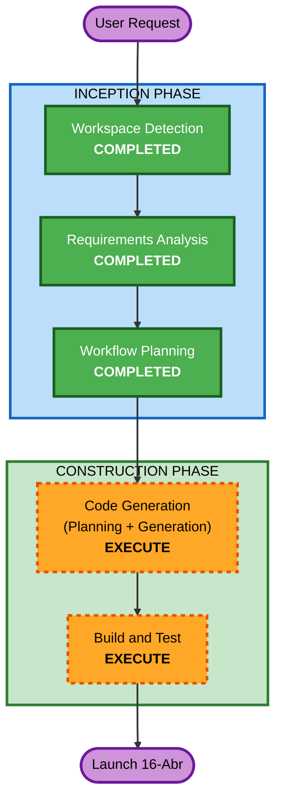

# Execution Plan
# NFT Collection Landing Site — "Pollos"

**Generated**: 2026-04-12
**Deadline**: 2026-04-16 (Miércoles) — 4 días

---

## Change Impact Assessment

- **User-facing changes**: Yes — sitio web completamente nuevo
- **Structural changes**: No — greenfield, no hay sistema previo
- **Data model changes**: No — sin base de datos, contenido estático
- **API changes**: No — sin API propia, solo links externos (Manifold, OpenSea)
- **NFR impact**: Mínimo — performance vía `next/image`, responsividad vía Tailwind mobile-first

## Risk Assessment

- **Risk Level**: Low
- **Rollback Complexity**: Easy — Vercel mantiene deploys anteriores, revert con un click
- **Testing Complexity**: Simple — verificación visual en mobile + desktop, no hay lógica de backend

---

## Workflow Visualization

---

## Phases to Execute

### INCEPTION PHASE
- [x] Workspace Detection — COMPLETED (greenfield)
- [x] Requirements Analysis — COMPLETED (requirements.md)
- [x] Workflow Planning — COMPLETED (este documento)
- [x] Reverse Engineering — SKIP: greenfield
- [x] User Stories — SKIP: scope simple y claro, 3 páginas definidas, único tipo de usuario (visitante/coleccionista), deadline de 4 días no justifica ceremonia extra
- [x] Application Design — SKIP: estructura de componentes ya definida en requirements.md (3 páginas + componentes listados), no hay servicios ni APIs propias
- [x] Units Generation — SKIP: proyecto cohesivo en una sola app Next.js, no descomponible en unidades independientes

### CONSTRUCTION PHASE
- [ ] Functional Design — SKIP: sin lógica de negocio compleja (countdown + galería estática + link externo)
- [ ] NFR Requirements — SKIP: NFRs simples ya capturados en requirements.md (Lighthouse ≥90, mobile-first, `next/image`), extensión ui-ux cubre estética
- [ ] NFR Design — SKIP: depende de NFR Requirements (skipped)
- [ ] Infrastructure Design — SKIP: Vercel maneja toda la infraestructura, no hay recursos cloud custom
- [ ] **Code Generation — EXECUTE** (siempre): Part 1 (plan de código) + Part 2 (generación)
- [ ] **Build and Test — EXECUTE** (siempre): Build, test visual, verificación mobile/desktop

### OPERATIONS PHASE
- [ ] Operations — PLACEHOLDER

---

## Resumen del Plan de Código (preview para Code Generation)

**Unit 1 (única)**: Todo el sitio

| Paso | Descripción |
|------|-------------|
| 1 | Scaffold Next.js + Tailwind + configuración base (Inter font, globals.css, layout) |
| 2 | Header + Footer + navegación mobile/desktop |
| 3 | Landing page: Hero + Preview Gallery + Manifiesto + Artista + Mint CTA + Countdown + FAQ |
| 4 | Página `/coleccion`: galería completa o embed OpenSea |
| 5 | Página `/crea-tu-pollo`: placeholder "Próximamente" |
| 6 | Data layer: `src/lib/nfts.ts` con datos de las 50 piezas (placeholder) |
| 7 | SEO: meta tags, og:image, favicon |
| 8 | Build + verificación visual + deploy a Vercel |

---

## Success Criteria

- [ ] Sitio online en Vercel antes del miércoles 16 de Abril
- [ ] Las 3 páginas cargan sin errores en mobile (375px) y desktop (1280px)
- [ ] Countdown muestra tiempo correcto al lanzamiento
- [ ] Botón de mint enlaza correctamente a Manifold (cuando URL esté disponible)
- [ ] Extension ui-ux-minimalist-standards cumplida: fondo blanco, Inter, arte protagonista, mobile-first
- [ ] Placeholders claramente marcados para reemplazo fácil
